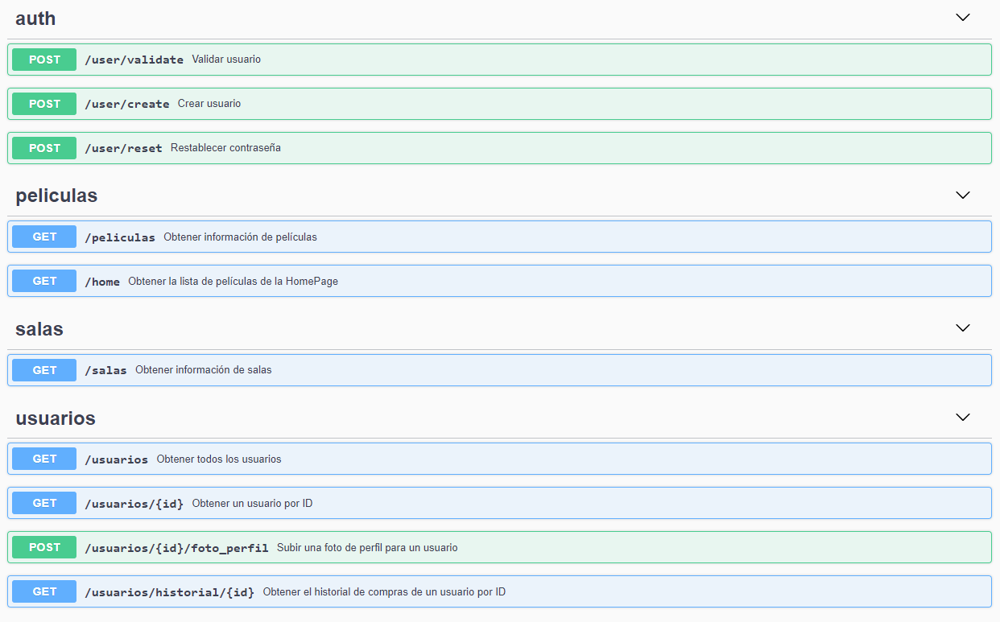

# Backend Cine ULima




## Instalación

Instalar las dependencias de ruby

```
gem install bundler
bundler install
``` 

En Linux, ejecutar el archivo `start_backend-sh`.

En Windows, correr los comandos
```
ruby app.rb
cd ./swagger 
npm start
```

## Recrear las bases de datos
Para recrear la base de datos implementada en el proyecto actual, ejecutar los scripts `DDL.sql` y `DML.sql` de la carpeta backup.

## Comandos SQL utilizados en los querys

